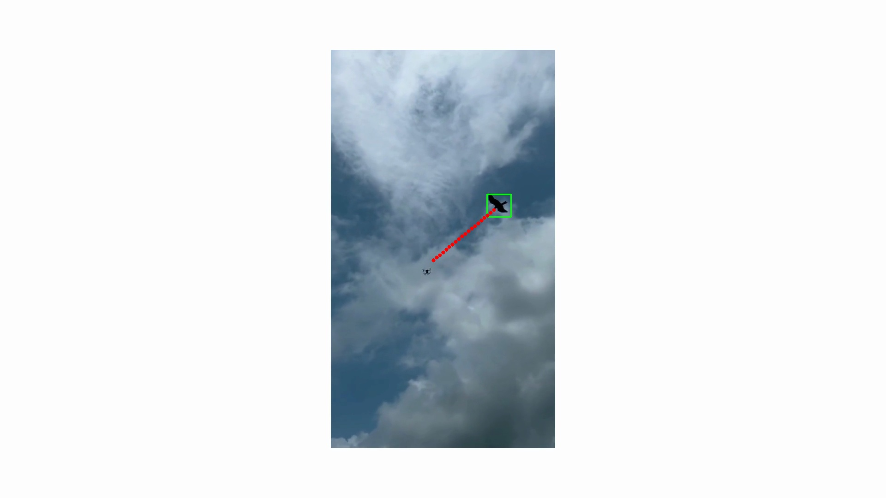

# 🛡️ Air Defense System (ADS)

This project is an experimental **Air Defense System** simulation that performs real-time aerial object detection, tracking, and trajectory prediction using computer vision. It can detect flying objects (e.g., drones, birds), predict their paths, and visualize their trajectories — a foundational piece for building intelligent airspace monitoring tools.

---

## 📽️ Features

- ✅ Real-time object detection using YOLOv8
- ✅ Object tracking via custom Kalman Filters and Deep SORT
- ✅ Predicts future positions of flying objects
- ✅ Marks and annotates potential airspace violations
- ✅ Snapshots frames with predicted path overlays
- ✅ Easily extensible for use in surveillance, drone tracking, and air defense simulations

---

## 📷 Example Detection & Prediction

Below is a frame from the video showing a bird (or drone) detected and its predicted path using Kalman filtering:



---

## 📦 Directory Structure

```

ADS/
├── annotation.py              # Drawing bounding boxes and predictions
├── assets/                    # Contains input video(s)
│   └── Drone\&Eagle.mp4
├── deep\_sort\_tracker.py       # Optional: for enhanced multi-object tracking (placeholder)
├── kalman\_predictor.py        # Kalman Filter for predicting object trajectory
├── main.py                    # Main runner for detection, tracking, prediction
├── requirements.txt           # Python dependencies
├── snapshots/                 # Saved snapshots of detection/prediction
│   └── frame\_55.jpg
├── tracker.py                 # Multi-object tracker logic
├── yolov8\_detector.py         # Wrapper for YOLOv8 detection
└── yolov8n.pt                 # Pretrained YOLOv8 model (nano version)

````

---

## 🚀 Getting Started

### 1. Clone the Repo

```bash
git clone https://github.com/VOID-ALIF/ADS.git
cd ADS
````

### 2. Install Dependencies

Use Python 3.9+ and install dependencies:

```bash
pip install -r requirements.txt
```

If YOLOv8 isn't installed:

```bash
pip install ultralytics
```

---

### 3. Run the System

```bash
python main.py
```

Press:

* `s` → Save a snapshot of current frame with annotations.
* `q` → Quit the program.

---

## 🧠 How It Works

1. **Detection**:

   * YOLOv8 detects aerial objects frame-by-frame.
2. **Tracking**:

   * Object centers are tracked with unique IDs.
3. **Prediction**:

   * A Kalman filter predicts the next 20 positions (future path).
4. **Annotation**:

   * Future trajectories and object IDs are overlaid on the video stream.
5. **Snapshots**:

   * Press `s` to save frames for further inspection.

---

## 📌 Future Ideas

* Integrate radar/sensor data (multi-modal fusion)
* Classify object types (e.g., bird, drone, aircraft)
* Detect and alert airspace violations
* Implement real-time response logic (e.g., threat prioritization)

---

## 🛠️ Dependencies

* Python 3.9+
* OpenCV
* NumPy
* filterpy (Kalman Filter)
* Ultralytics (YOLOv8)

---

## 📜 License

MIT — free to use and modify.

---

## 👤 Author

**@VOID-ALIF**
Air Defense enthusiast, software engineer, and deep tech builder.

---

```
